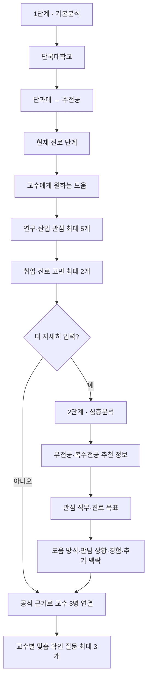

# 나의 교수님 — 찾다 2단계 심층분석 인계서

기준일: 2026-07-29
작업 브랜치: `refactor/your-professor-core-v2`
상태: 로컬 구현·자동 검증·데스크톱/390px 실사용 검증 완료, 원격 저장소 미반영

## 1. 이번 결정

`나의 교수님 — 찾다`를 처음 방문한 대학생도 선택만으로 시작할 수 있는 2단계 흐름으로 개편했다.

1. 캠퍼스는 묻지 않는다.
2. 학교는 현재 `단국대학교` 버튼 하나만 제공한다.
3. 단국대학교 선택 뒤 단과대와 학과·전공을 종속 선택한다.
4. 주전공은 필수, 부전공·복수전공·연계융합전공은 선택 심층정보다.
5. 연구·산업 관심과 취업·진로 고민을 분리한다.
6. 교수 추천은 점수나 순위가 아니라 `주제·방법·확장` 세 관점과 공식 근거로 설명한다.
7. 취업 고민·만남 상황은 교수의 연구 근거를 바꾸지 않고 면담 질문을 개인화한다.

## 2. 학생 입력 흐름

### 1단계 필수 입력

| 입력 | 제한 | 사용처 |
|---|---:|---|
| 학교 | 단국대학교 1개 | 공식 교수 데이터 범위 확인 |
| 단과대·주전공 | 안전하게 관계가 확인된 목록 또는 직접 입력 | 주전공 우선 연결 근거 |
| 현재 단계 | 6개 중 1개 | 면담 질문의 현재 상황 |
| 원하는 도움 | 5개 중 1개 | 면담 질문의 행동 목적 |
| 관심 연구·산업 분야 | 18개+직접 입력, 최대 5개 | 교수 연구분야·공식 논문 대조 |
| 취업·진로 고민 | 10개, 최대 2개 | 면담 질문 개인화 |

### 2단계 선택 입력

| 입력 | 제한 | 사용처 |
|---|---:|---|
| 부·복수전공 유형 | 없음/부전공/복수전공/연계융합 | 융합 가능성 보조 신호 |
| 부·복수전공 학과 | 단과대 종속 목록 또는 직접 입력 | 주전공과 다른 보조 학문 축 |
| 관심 직무 | 12개, 최대 3개 | 연구를 학교 밖 진로와 연결 |
| 진로 목표 | 7개 중 1개 | 질문의 목표 구체화 |
| 원하는 도움 방식 | 5개 중 1개 | 면담 준비 개인화 |
| 만날 상황 | 4개 중 1개 | 첫마디·메일·오피스아워 준비 |
| 궁금한 주제 | 선택 서술 | 사용자가 확인하려는 질문 |
| 수업·프로젝트·도구 경험 | 선택 서술 | 가능한 시작점 제안 |
| 추가 맥락 | 선택 서술 | 설명에 필요한 제약과 배경 |

## 3. 단국대학교 학사 데이터 경계

- 공식 교수: 1,051명
- 안전하게 복원한 단과대: 20개
- 안전하게 종속 연결한 학과·전공: 111개
- 현재 단과대 관계를 추측하지 않는 미연결 학과: 4개
  - 한국학과
  - 골프전공
  - 동물생명공학전공
  - 연기영상예술학과

교수 런타임에서 단과대와 학과가 각각 합쳐진 다중소속 레코드는 가짜 조합을 만들 수 있으므로 종속 목록 생성에 사용하지 않는다. 사용자가 목록에서 찾지 못하면 직접 입력할 수 있고, 직접 입력값은 공식 소속으로 단정하지 않는다.

## 4. 근거와 개인화 분리

### 교수 공식 근거 대조에 사용하는 값

- 아이디어 제목·질문·방법
- 주전공
- 부·복수전공
- 관심 연구·산업 분야
- 관심 직무

### 공식 연구 근거로 사용하지 않는 값

- 취업·진로 고민
- 현재 진로 단계
- 교수에게 원하는 도움
- 만날 상황
- 원하는 도움 방식
- 자유 맥락

두 번째 묶음은 교수 선택 근거를 오염시키지 않고, 결과 카드의 `내 고민으로 확인할 질문`을 최대 3개 만드는 데만 사용한다. 첫 질문은 현재 단계·원하는 도움·진로 고민, 둘째 질문은 주전공·부전공·직무·진로 목표, 셋째 질문은 만날 상황·도움 방식·경험·추가 맥락을 묶는다. 질문은 교수의 실제 답변이나 지도 가능성을 미리 단정하지 않는다.

## 5. 주요 코드

| 책임 | 파일 |
|---|---|
| 2단계 화면과 종속 선택 UI | `components/screens/professor-discovery-form.tsx` |
| 화면 상태·추천 결과·맞춤 질문 연결 | `components/screens/official-professor-screens.tsx` |
| 입력 선택지·검증·질문 생성 | `lib/professor-discovery-model.ts` |
| 안전한 단과대–학과 구조 | `lib/professor-academic-taxonomy.ts` |
| 클라이언트 요청 변환 | `lib/professor-discovery-client.ts` |
| 공식 연구근거 입력 경계 | `lib/professor-match-evidence.ts` |
| 공식 교수 데이터와 세 관점 규칙 | `lib/professor-data.server.ts` |
| API 정규화·실제 본문 크기 제한 | `app/api/professors/match/route.ts` |
| 전용 자동 테스트 | `scripts/tests/professor-discovery-flow.test.mjs` |
| 실제 API 회귀 | `scripts/verify-professor-matches.mjs` |

## 6. 검증 결과

| 검증 | 결과 |
|---|---|
| `npm.cmd run test:professor-discovery` | 5/5 통과 |
| `npm.cmd run professors:test` | 12/12 통과 |
| `npm.cmd run test:favorite-paper` | 4/4 통과 |
| `npm.cmd run typecheck` | 통과 |
| `npm.cmd run build` | 최신 `main` 병합 후 통과, 37개 경로 생성 |
| 실제 교수 API 회귀 | 5개 주제 모두 3역할·중복 없음·무점수·무순위 |
| 실제 심층 입력 API | 교수 3명, `TOPIC/METHOD/CONTEXT`, 공식 1,051명 범위 |
| 헤더 없는 대용량 요청 | 본문 스트림을 12KB까지만 누적하고 초과 즉시 413 |
| 데스크톱 브라우저 | 단국대→경영경제대학→경제학과→심층분석→부전공 SW→교수 3명 완료 |
| 390px 브라우저 | 기본·심층 단계, 종속 학과 선택, 가로 넘침 0 |
| 브라우저 콘솔 | 오류·경고 없음 |

## 7. 작업 중 발견한 오류와 해결 원리

1. 교수 원본 구조를 처음 확인할 때 `professors` 키로 조회해 실패했다. 실제 런타임 키는 `records`였고, 이후 스키마를 먼저 확인한 뒤 집계했다.
2. 일반 전공명 `경제학`이 공식 `경제학과`로 연결되지 않았다. `학과/학부/전공` 접미어를 구분해 정규화하고, 유일한 경우에만 자동 보정했다.
3. 질문 문장에 `경제학과과`, `[redacted-phone]` 같은 잔여 표현이 나타났다. 조사에 의존하지 않는 문장으로 바꾸고 redaction 토큰을 제거했다.
4. 기존 실제 API 회귀는 만남 상황을 공식 연구 근거로 취급했다. 새 제품 원칙에 맞게 만남 상황은 연구 근거에서 제외하고 맞춤 질문 테스트로 이동했다.
5. 실제 API 검증 스크립트 기본 주소가 3000이라 3100 서버에서 처음 실패했다. 로컬 검증 시 주소를 인자로 명시한다.
6. 모바일 44px 규칙이 더 구체적인 40px CSS에 덮였다. 모바일 선택칩과 단계 버튼에 더 구체적인 선택자로 44px 최소 높이를 적용했다.
7. 최종 독립 검토에서 도움 목적이 자동 연구 질문을 거쳐 공식 근거에 섞이고 일부 심층 입력이 결과에 쓰이지 않는 문제를 발견했다. 자동 연구 질문은 전공·주제로만 만들고, 기본·심층 맥락 전체는 최대 3개의 면담 질문으로 분리했다.
8. 관심 분야를 번호로 표시했지만 매칭은 순서를 사용하지 않았다. 우선순위로 오해하지 않도록 번호와 `중요한 순서` 문구를 제거했다.
9. 본문 크기를 `request.text()` 뒤에 확인하면 헤더 없는 대용량 요청을 먼저 메모리에 올리게 된다. 스트림을 12KB까지만 누적하고 초과 즉시 취소하도록 바꿨다.
10. PowerShell의 기본 파이프 인코딩으로 한글이 포함된 인라인 Node 검증 코드를 넘기자 `단국대학교`가 손상되어 422 범위 오류가 발생했다. API 문제가 아니라 검증 입력 인코딩 문제였으며, 자동 검증에서는 한글 리터럴을 유니코드 이스케이프로 전달해 재실행했다.

## 8. 남은 위험과 다음 작업

1. 4개 미연결 학과는 정확한 단과대–학과 원본 관계를 수집 파이프라인에서 보존해야 자동 선택 목록에 넣을 수 있다.
2. 교수 추천 결과는 공식 프로필에 공개된 정보 범위다. 면담 가능 여부·학생 모집 여부·현재 강의시간표는 별도 최신 데이터가 필요하다.
3. 현재 복잡한 입력은 화면 로컬 상태라 새로고침하면 초기화된다. 사용성 검증 후 세션 복구 여부를 결정한다.
4. 관심·직무 선택지가 모든 진로를 완전히 포괄하지는 않는다. 실제 대학생 테스트에서 `직접 입력` 사용 비율을 기록해 보완한다.
5. 공개 배포 전 API 사용량 제한과 익명 요청 보호를 추가한다.

## 9. 팀 검토 경로

1. `http://127.0.0.1:3100/professors`를 연다.
2. 단국대학교 → 경영경제대학 → 경제학과를 선택한다.
3. 취업 준비, 취업·직무 조언, 경제·금융, 취업시장·전망을 고른다.
4. 심층분석에서 부전공 → SW융합대학 → 소프트웨어학과를 고른다.
5. 데이터·AI 직무, 민간기업 취업, 오피스아워와 경험을 입력한다.
6. 세 관점 교수 3명과 교수별 확인 질문을 살핀다.
7. 점수·순위가 없고, 진로 고민이 공식 연구근거처럼 표시되지 않는지 확인한다.

## 10. 최신 `main` 통합 결과

- 병합 기준: `origin/main` `9e7926f`
- 통합 커밋: `d76916a`
- 함께 보존한 최신 기능:
  - PDF 원문·번역·질문·그림 해설을 포함한 논문 리더
  - 데스크톱 내비게이션과 브랜드 장면
  - 교수 강의정보·교수님 퀘스트 미니도구·포트폴리오 확장 화면
  - AI 엔드포인트 사용량 제한과 공동설계 응답 성능 개선
- 라우팅:
  - `/paper/reader`: 최신 PDF 논문 리더
  - `/paper/reader?mode=bite`: 논문 한입 3분 준비 카드
  - `/paper/reader?mode=bite&source=favorites`: 즐겨찾기 교수·공식 논문 선택 창 자동 열기
- 실제 브라우저 재검증:
  - 1440px 교수 3카드 병렬 배치와 가로 넘침 없음
  - 390px 입력 컨트롤 44px 이상, 가로 넘침 없음
  - 기본분석 입력부터 교수 3관점 결과까지 재실행 성공
  - 교수 즐겨찾기 후 최근 공식 논문 6건 조회·선택·제목 자동 입력 성공
  - 공식 서지정보와 사용자가 붙여 넣는 분석 원문이 분리되어 표시됨
