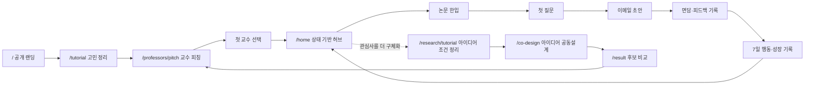
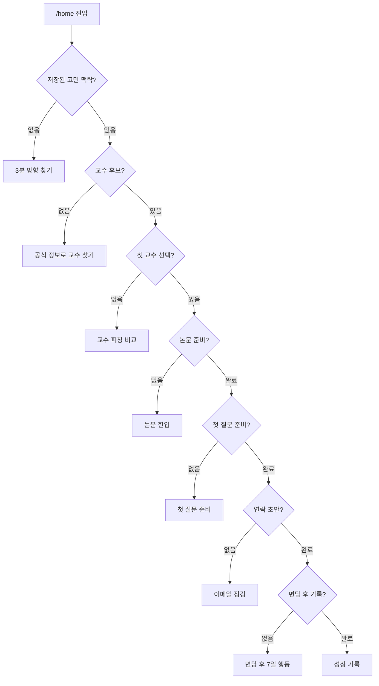

# 너의 교수님은? 서비스 흐름

기준일: 2026-08-23

범위: 랜딩·튜토리얼·교수 연결·대화 준비·면담 후 행동·성장 기록

## 한 문장 서비스 정의

대학생이 전공·진로 고민을 자연스럽게 정리하고, 학교 공식 정보로 지금 대화할 교수를 찾은 뒤, 첫 질문과 다음 행동까지 준비하는 서비스다.

AI는 교수를 평가하거나 진로의 답을 대신하지 않는다. 학생 입력과 공식 정보를 정리해 연결 이유와 직접 확인할 질문을 만드는 역할을 맡는다.

## 전체 사용자 여정

### 흐름 원칙

1. 튜토리얼 직후에는 대시보드를 거치지 않고 약속한 교수 피칭을 바로 보여준다.
2. 교수 선택 뒤부터 대시보드가 현재 상태를 읽어 다음 행동 하나를 제안한다.
3. 논문 한입은 필수 관문이 아니다. 공식 논문이 미기재되거나 학생이 원하지 않으면 첫 질문으로 건너뛸 수 있다.
4. 연구 아이디어는 선택적 심화 기능이다. 대학생의 일반적인 전공·진로 고민도 교수 대화로 연결할 수 있다.
5. 연락·면담·최종 선택은 학생이 직접 진행한다.
6. 전공 아이디어 튜토리얼은 최종 확인 전까지 교수 연결과 성장 기록을 바꾸지 않는다.
7. 최상위 허브는 세부 기능을 모두 펼치지 않고, 저장 상태에 맞는 다음 행동 하나와 짧은 행 목록만 보여준다.

## 상태 기반 홈

홈은 완료하지 않은 가장 앞 단계 하나만 주 행동으로 제시한다. 나머지 기능은 진행 레일과 `전체 기능` 목록에서 언제든 비선형으로 이동할 수 있다.

## 화면 연결표

| 단계 | 라우트 | 입력 | 출력·저장 | 다음 상태 |
| --- | --- | --- | --- | --- |
| 서비스 이해 | `/` | 없음 | 없음 | 튜토리얼 |
| 교수 찾기 허브 | `/professors` | 저장된 교수 연결 상태 | 다음 교수 행동 | 튜토리얼·피칭·대화 준비 |
| 교수 조건 직접 입력 | `/professors/discover` | 학교·전공·관심·진로 고민 | 교수 매칭 조건 | 교수 피칭 |
| 고민 정리 | `/tutorial` | 전공·현재 단계·필요 도움·관심·고민 | `professorDiscoveryTopic`, 교수 매칭 | 교수 피칭 |
| 교수 비교 | `/professors/pitch` | 학생 고민·공식 교수 정보 | `selectedProfessorId` | 홈 또는 교수 상세 |
| 상태 허브 | `/home` | 저장된 전 여정 상태 | 다음 행동·진행률·최근 기록 | 미완료 단계 |
| 교수 상세 | `/professors/[id]` | 교수 ID | 공식 분야·논문·출처 확인 | 논문 또는 대화 준비 |
| 논문 한입 | `/paper/reader?mode=bite&source=favorites` | 연결 교수·공식 논문·학생 제공 텍스트 | 편집 가능한 5카드 | 첫 질문 |
| 첫 질문 | `/quest/first-line` | 교수 근거·학생 목적 | 학생이 편집한 첫 문장 | 이메일 준비 |
| 대화 준비 허브 | `/quest` | 현재 교수·저장 카드 | 다음 준비 행동·단계 요약 | 각 퀘스트 |
| 전체 대화 도구 | `/quest/all` | 현재 교수·저장 카드 | 5개 도구·저장 카드 | 각 퀘스트 |
| 이메일 | `/quest/email-guard` | 교수·학생 고민 맥락 | 소개·질문·이메일 초안 | 학생 직접 연락 |
| 면담 후 | `/mentor-loop` | 교수 피드백 | 수정 전후·7일 행동 | 성장 기록 |
| 성장 기록 허브 | `/portfolio` | 실제 저장 결과 | 완료 단계·다음 빈 단계 | 기록 만들기·재방문 홈 |
| 포트폴리오 만들기 | `/portfolio/builder` | 실제 저장 결과 | 선택 단계 미리보기·PDF | 성장 기록 허브 |
| 내 기록 관리 | `/portfolio/manage` | 저장 종류별 건수 | 사용자 확인 후 삭제 | 성장 기록 허브 |
| 아이디어 조건 정리 | `/research/tutorial` | 전공·탐색 방식·관심·경험·방법·기간·자료 | 브라우저 임시 초안 | 공동설계 |
| 아이디어 빠른 입력 | `/research` | 같은 조건을 한 화면에서 입력 | 공동설계 조건 | 공동설계 |
| 아이디어 공동설계 | `/co-design` | 최종 확인한 조건 | 질문별 사용자 확인 답변 | 후보 비교 |
| 아이디어 후보 비교 | `/result` | 조건·공동설계 답변 | 근거와 확인 항목이 있는 후보 2개 | 교수 찾기 |

## 데이터·신뢰 경계

- 교수 이름·소속·연구분야·논문은 대학 공식 프로필 공개 범위에서 사용한다.
- `미기재`와 `수집 실패`를 구분한다.
- 교수 궁합 점수·순위·면담 가능성·지도 가능성을 만들지 않는다.
- 튜토리얼 입력은 학생이 확인한 고민 맥락으로만 저장하며 공식 교수 근거처럼 표시하지 않는다.
- 논문 제목과 서지는 공식 프로필에서 확인하되, 초록·본문은 학생이 같은 논문인지 확인하고 제공한다.
- 홈의 최근 기록과 진행률은 실제 저장 데이터로만 계산한다.
- 전공 아이디어 튜토리얼 초안은 로컬 임시 저장이며, `공동설계 시작` 전에는 기존 교수 연결 상태를 덮어쓰지 않는다.

## 실패·복구

- 교수 매칭 실패: 입력을 보존하고 재시도한다.
- 공식 논문 없음: 논문이 없다고 단정하지 않고 공식 프로필 확인·직접 입력·건너뛰기를 제공한다.
- AI 분석 실패: 학생 입력과 교수 선택을 보존한 채 수동 편집으로 전환한다.
- 새로고침: 저장소 복원 전에는 로딩 상태를 보여주고, 복원 후 정확한 다음 행동을 계산한다.
- 연결한 교수가 즐겨찾기에 없어도 논문 선택 목록에 현재 연결 교수를 포함한다.
- 연구 아이디어를 만들지 않은 학생도 튜토리얼 고민 맥락으로 첫 질문·이메일·면담 기록을 이어간다.
- 전공 아이디어 튜토리얼 이탈: 같은 브라우저에서 마지막 단계와 입력을 복원하고, 한 화면 입력이 편한 학생은 `/research`로 전환한다.

상세 홈 상태 계약과 시각 검수는 `design/home-dashboard-v2/`를 기준으로 한다.
전공 아이디어 튜토리얼의 흐름·상태·PC/모바일 시각 기준은 `design/research-tutorial-v1/`을 기준으로 한다.
토스·당근 구조 원칙을 적용한 교수·대화 준비·성장 기록 허브는 `design/service-hubs-v1/`을 기준으로 한다.
AI 생성형 템플릿의 흔적을 줄인 공통 간격·반경·그림자·미디어 규칙과 검증 화면은 `design/front-polish-v1/`을 기준으로 한다.
